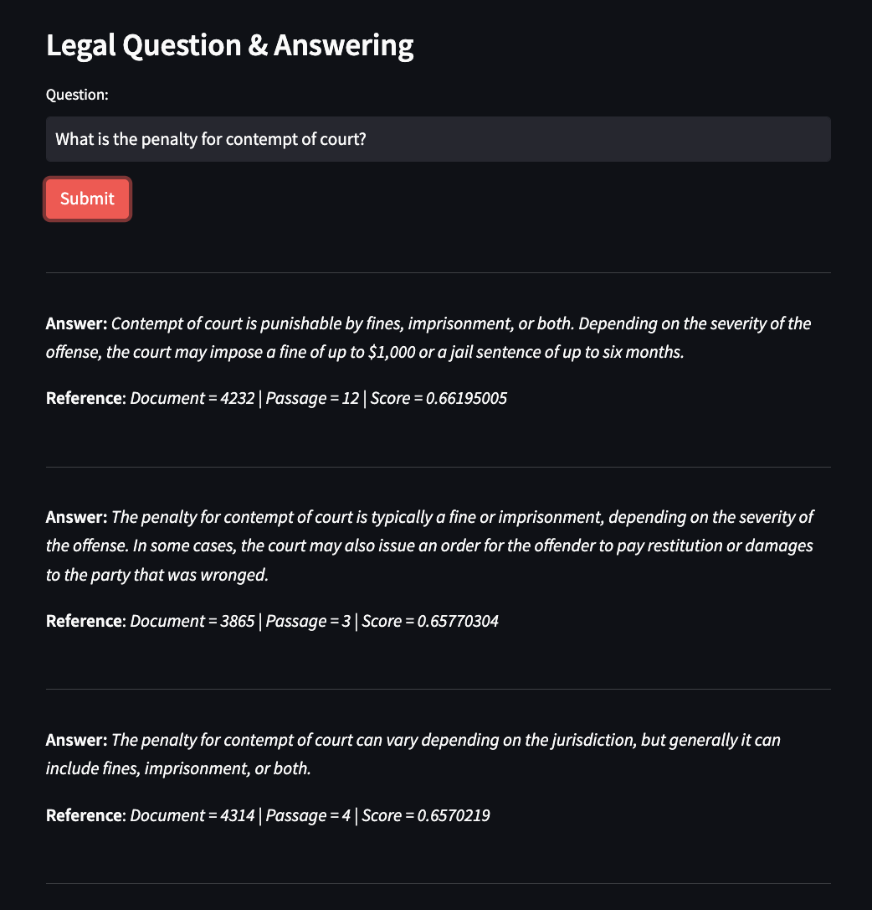

# Knowledge Augmented LLMs
Context is Key: Combining Embedding-based Retrieval with LLMs for Comprehensive Knowledge Augmentation & Enrichment

Article: https://medium.com/@shankar.arunp/augmenting-large-language-models-with-verified-information-sources-leveraging-aws-sagemaker-and-f6be17fb10a8
